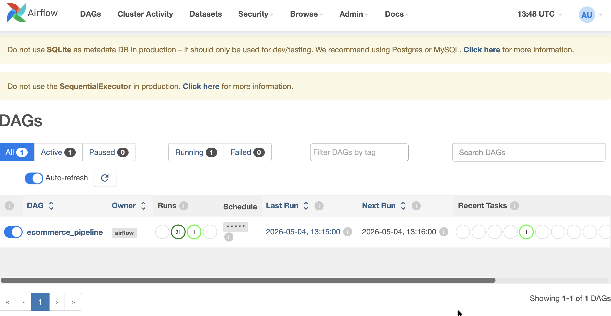
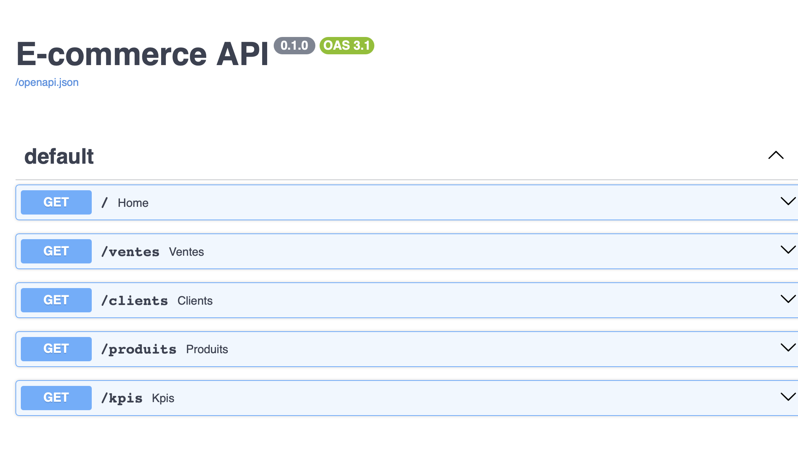
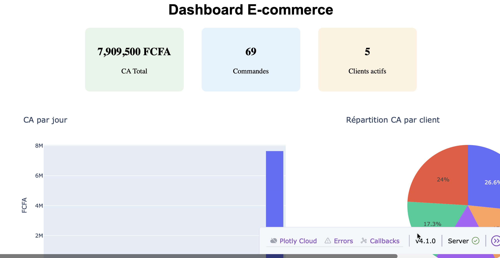
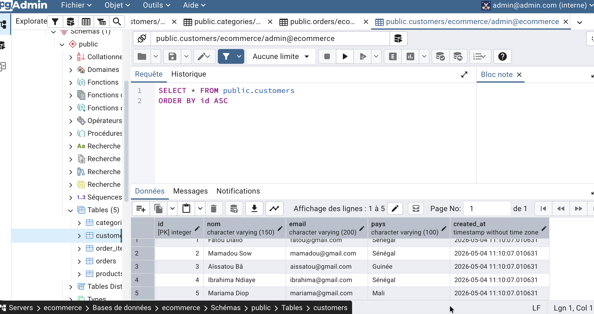

# E-commerce MLOps Pipeline

Pipeline de données et ML complet simulant un système e-commerce réel.

## Architecture
Sources → PostgreSQL → Airflow → Dash Dashboard
↓
Scikit-learn (Churn)
↓
FastAPI (REST API)

## Stack technique
| Outil | Rôle |
|-------|------|
| Docker | Conteneurisation |
| PostgreSQL | Stockage des données |
| Apache Airflow | Orchestration pipeline |
| Dash + Plotly | Dashboard temps réel |
| FastAPI | API REST |
| Scikit-learn | Modèle prédiction churn |

## Fonctionnalités
- Pipeline automatique d'insertion de commandes toutes les minutes
- Dashboard temps réel avec KPIs e-commerce
- API REST avec 5 endpoints documentés
- Modèle ML de prédiction churn client

## Lancer le projet

### Prérequis
- Docker
- Python 3.11+
- uv

### Base de données
```bash
docker run --name postgres-ecom \
  -e POSTGRES_USER=admin \
  -e POSTGRES_PASSWORD=admin123 \
  -e POSTGRES_DB=ecommerce \
  -p 5432:5432 -d postgres:15
```

### Airflow
```bash
docker run --name airflow \
  -p 8080:8080 \
  --link postgres-ecom:postgres \
  -e AIRFLOW__CORE__LOAD_EXAMPLES=False \
  -d apache/airflow:2.8.0 standalone
```

### Dashboard
```bash
uv run python dashboard/app.py
# http://localhost:8050
```

### API
```bash
uvicorn api.main:app --reload --port 8000
# http://localhost:8000/docs
```

### Modèle churn
```bash
uv run python ml/churn_model.py
```

## Screenshots



